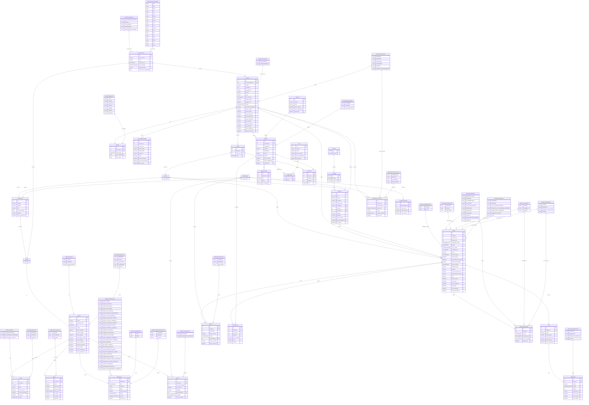

# Diagrama Entidad-Relación — Bajoneá

```mermaid
erDiagram

    %% ============================================================
    %% ENUMERACIONES
    %% ============================================================

    ENUM_RolUsuario {
        string CLIENTE
        string COMERCIO
        string ADMINISTRADOR
    }

    ENUM_EstadoUsuario {
        string PENDIENTE
        string ACTIVO
        string BLOQUEADO
        string SUSPENDIDO
        string INACTIVO
    }

    ENUM_CondicionIva {
        string RESPONSABLE_INSCRIPTO
        string EXENTO
        string NO_INSCRIPTO
        string MONOTRIBUTO
        string RESPONSABLE_NACIONAL
    }

    ENUM_TipoPersonaJuridica {
        string SA
        string SRL
        string SAS
        string SC
        string SCS
        string SCRL
        string SCSA
        string SCCS
        string CC
        string CS
        string CCSA
        string CA
        string SP
        string ST
        string ACP
        string EMP
        string EU
        string UTE
    }

    ENUM_TipoComercio {
        string RESTAURANTE
        string EMPRENDIMIENTO
    }

    ENUM_EstadoComercio {
        string PENDIENTE
        string APROBADO
        string RECHAZADO
        string SUSPENDIDO
        string INACTIVO
        string CERRADO_TEMPORALMENTE
    }

    ENUM_DiaSemana {
        string LUNES
        string MARTES
        string MIERCOLES
        string JUEVES
        string VIERNES
        string SABADO
        string DOMINGO
    }

    ENUM_TipoAccionComercio {
        string APROBACION
        string RECHAZO
        string SUSPENSION
        string REACTIVACION
    }

    ENUM_TipoToken {
        string VERIFICACION_EMAIL
        string RECUPERACION_PASSWORD
        string REACTIVACION_CUENTA
    }

    ENUM_EstadoToken {
        string PENDIENTE
        string UTILIZADO
        string EXPIRADO
    }

    ENUM_TipoCierreSesion {
        string MANUAL
        string AUTOMATICO
        string FORZADO
    }

    ENUM_EstadoProducto {
        string DISPONIBLE
        string AGOTADO
        string DESCONTINUADO
    }

    ENUM_ModalidadEntrega {
        string DOMICILIO
        string RETIRO
    }

    ENUM_MotivoRechazo {
        string SIN_STOCK
        string CERRADO
        string ALTO_VOLUMEN_PEDIDOS
        string PRODUCTO_NO_DISPONIBLE_TEMPORAL
        string SIN_DELIVERY_DISPONIBLE
        string PROBLEMA_TECNICO
        string OTRO
    }

    ENUM_EstadoPedido {
        string PENDIENTE_PAGO
        string PENDIENTE
        string EN_PREPARACION
        string EN_CAMINO
        string LISTO_PARA_RETIRAR
        string ENTREGADO
        string RECHAZADO
        string CANCELADO
        string ANULADO
        string CANCELADO_POR_SISTEMA
        string EXPIRADO
    }

    ENUM_EstadoPagoPedido {
        string PENDIENTE
        string PAGADO
        string RECHAZADO
    }

    ENUM_CanceladoPor {
        string CLIENTE
        string COMERCIO
        string SISTEMA
    }

    ENUM_FuenteEntrega {
        string CLIENTE
        string COMERCIO
        string COMERCIO_SIN_RETIRO
        string SISTEMA
    }

    ENUM_EstadoNotaCredito {
        string PENDIENTE
        string PROCESADO
        string PENDIENTE_REINTENTO
        string FALLIDO
    }

    ENUM_EstadoReclamo {
        string PENDIENTE
        string APROBADO
        string RECHAZADO
    }

    ENUM_ResultadoSoporte {
        string REACTIVADO
        string SUSPENSION_MANTENIDA
    }

    ENUM_CanalNotificacion {
        string PUSH
        string EMAIL
    }

    ENUM_EstadoEnvioNotificacion {
        string PENDIENTE
        string ENVIADO
        string FALLIDO
    }

    ENUM_TipoNotificacion {
        string NUEVO_PEDIDO
        string PEDIDO_ACEPTADO
        string PEDIDO_RECHAZADO
        string PEDIDO_EN_CAMINO
        string PEDIDO_LISTO_RETIRO
        string AVISO_75MIN_SIN_CONFIRMACION
        string PEDIDO_AUTOCONFIRMADO
        string PEDIDO_CANCELADO_CLIENTE
        string PEDIDO_ANULADO_COMERCIO
        string PEDIDO_CANCELADO_SISTEMA
        string PEDIDO_EXPIRADO_CLIENTE
        string PEDIDO_EXPIRADO_COMERCIO
        string COMERCIO_APROBADO
        string COMERCIO_RECHAZADO
        string COMERCIO_SUSPENDIDO
        string NUEVO_COMERCIO_PENDIENTE
        string NUEVA_RESOLICITUD_COMERCIO
        string NUEVO_RECLAMO
        string RECLAMO_APROBADO
        string RECLAMO_RECHAZADO
        string NUEVO_MENSAJE_SOPORTE
        string PRODUCTO_REMOVIDO_CARRITO
        string CUENTA_INACTIVADA
        string COMERCIO_INACTIVADO
        string PEDIDO_CERRADO_TIMER_SUSPENSION
        string REEMBOLSO_FALLIDO_DEFINITIVO
        string CLIENTE_SUSPENDIDO
        string SUSPENSION_LEVANTADA
        string PEDIDO_AUTOCONFIRMADO_COMERCIO
    }

    %% ============================================================
    %% TABLAS PRINCIPALES
    %% ============================================================

    Provincia {
        varchar id PK
        varchar nombre
    }

    Localidad {
        varchar id PK
        varchar nombre
        varchar provincia_id FK
    }

    Usuario {
        int id PK
        varchar email
        varchar password_hash
        RolUsuario rol
        EstadoUsuario estado
        boolean email_verificado
        int intentos_fallidos
        datetime fecha_registro
        datetime fecha_ultimo_acceso
        datetime fecha_bloqueo
        datetime fecha_suspension
        varchar motivo_suspension
        datetime fecha_inactivo
        datetime fecha_reactivacion
        datetime fecha_actualizacion
    }

    Persona {
        int id PK
    }

    PersonaFisica {
        int id PK
        varchar nombre
        varchar apellido
        varchar dni
        date fecha_nacimiento
        varchar telefono
        datetime fecha_modificacion
    }

    PersonaJuridica {
        int id PK
        varchar razon_social
        varchar cuit
        CondicionIva condicion_iva
        TipoPersonaJuridica tipo_sociedad
        varchar domicilio_fiscal
        date fecha_inicio_actividades
    }

    Cliente {
        int id PK
    }

    Administrador {
        int id PK
    }

    Comercio {
        int id PK
        int persona_juridica_id FK
        varchar nombre
        text descripcion
        varchar foto_perfil_url
        varchar telefono
        varchar email
        TipoComercio tipo_comercio
        boolean acepta_delivery
        boolean acepta_retiro
        EstadoComercio estado
        boolean cerrado_manualmente
        varchar motivo_rechazo
        datetime fecha_rechazo
        datetime fecha_resolicitud
        datetime fecha_suspension
        varchar motivo_suspension
        boolean mp_vinculado
        datetime fecha_aprobacion
        datetime fecha_registro
        datetime fecha_modificacion
        datetime fecha_reactivacion
    }

    Direccion {
        int id PK
        varchar calle
        varchar numero
        varchar piso_depto
        varchar codigo_postal
        varchar localidad_id FK
        int cliente_id FK
        int comercio_id FK
        boolean principal
        boolean eliminada
        datetime fecha_creacion
        datetime fecha_modificacion
        datetime fecha_baja
    }

    Horario {
        int id PK
        int comercio_id FK
        DiaSemana dia_semana
        time hora_apertura
        time hora_cierre
    }

    Token {
        int id PK
        int usuario_id FK
        TipoToken tipo
        varchar token
        datetime fecha_creacion
        datetime fecha_vencimiento
        datetime fecha_uso
        EstadoToken estado
    }

    Sesion {
        int id PK
        int usuario_id FK
        boolean activa
        datetime fecha_inicio
        datetime fecha_cierre
        TipoCierreSesion tipo_cierre
        varchar ip_origen
        varchar navegador
        varchar dispositivo
    }

    Notificacion {
        int id PK
        int usuario_id FK
        TipoNotificacion tipo
        varchar mensaje
        boolean leida
        datetime fecha_creacion
        CanalNotificacion canal
        EstadoEnvioNotificacion estado
        datetime fecha_envio
    }

    Soporte {
        int id PK
        int usuario_id FK
        text mensaje_descargo
        datetime fecha_envio
        boolean atendido
        int administrador_id FK
        ResultadoSoporte resultado
        datetime fecha_resolucion
    }

    Reclamo {
        int id PK
        int pedido_id FK
        text descripcion
        datetime fecha_creacion
        EstadoReclamo estado
        int administrador_id FK
        varchar motivo_rechazo
        datetime fecha_resolucion
    }

    HistorialAccionComercio {
        int id PK
        int comercio_id FK
        int administrador_id FK
        TipoAccionComercio tipo_accion
        varchar motivo
        EstadoComercio estado_resultante
        datetime fecha_hora
    }

    ConfiguracionTarifa {
        int id PK
        int administrador_id FK
        decimal cargo_cliente
        decimal cargo_comercio
        datetime fecha_vigencia
    }

    CuentaMercadoPago {
        int id PK
        int comercio_id FK
        varchar mp_user_id
        varchar access_token
        varchar refresh_token
        varchar public_key
        boolean activa
        datetime fecha_vinculacion
        datetime fecha_desvinculacion
        datetime token_expira
    }

    Categoria {
        int id PK
        varchar nombre
        boolean activo
        datetime fecha_creacion
        datetime fecha_modificacion
        datetime fecha_baja
    }

    Tag {
        int id PK
        varchar nombre
        boolean activo
        datetime fecha_creacion
        datetime fecha_modificacion
        datetime fecha_baja
    }

    Producto {
        int id PK
        int comercio_id FK
        int categoria_id FK
        varchar nombre
        text descripcion
        decimal precio
        EstadoProducto estado
        datetime fecha_creacion
        datetime fecha_modificacion
        datetime fecha_baja
    }

    ImagenProducto {
        int id PK
        int producto_id FK
        varchar url
        int orden
        boolean es_principal
    }

    ProductoTag {
        int producto_id PK
        int tag_id PK
    }

    Carrito {
        int id PK
        int cliente_id FK
        int comercio_id FK
        boolean activo
    }

    ItemCarrito {
        int id PK
        int carrito_id FK
        int producto_id FK
        int cantidad
        varchar nota
    }

    Pedido {
        int id PK
        int cliente_id FK
        int comercio_id FK
        int direccion_id FK
        ModalidadEntrega modalidad_entrega
        EstadoPedido estado
        EstadoPagoPedido pago_estado
        CanceladoPor cancelado_por
        varchar motivo
        FuenteEntrega fuente_entrega
        datetime fecha_entrega
        datetime suspension_retiro_expira
        boolean primer_aviso_emitido
        MotivoRechazo motivo_rechazo
        varchar detalle_rechazo
        decimal subtotal
        decimal cargo_servicio_cliente
        decimal cargo_servicio_comercio
        decimal total
        datetime fecha_creacion
        datetime fecha_pago
        datetime fecha_aceptacion
        datetime fecha_listo
        datetime fecha_despacho
        datetime fecha_cancelacion
    }

    DetallePedido {
        int id PK
        int pedido_id FK
        int producto_id FK
        int cantidad
        decimal precio_unitario
        varchar nota
        decimal subtotal
    }

    HistorialEstadoPedido {
        int id PK
        int pedido_id FK
        EstadoPedido estado
        CanceladoPor cancelado_por
        FuenteEntrega fuente_entrega
        datetime fecha_hora
    }

    Pago {
        int id PK
        int pedido_id FK
        decimal monto
        varchar metodo_pago
        varchar id_transaccion_mp
        datetime fecha_creacion
        datetime fecha_confirmacion
    }

    NotaCredito {
        int id PK
        int pago_id FK
        decimal monto
        EstadoNotaCredito estado
        int intentos
        varchar refund_id_mp
        datetime fecha_emision
        datetime fecha_proceso
        datetime fecha_fallido
    }

    %% ============================================================
    %% RELACIONES LÓGICAS
    %% ============================================================

    Provincia ||--o{ Localidad : "contiene"
    Localidad ||--o{ Direccion : "ubica"
    Persona ||--|| Usuario : "es"
    PersonaFisica ||--|| Persona : "extiende"
    PersonaJuridica ||--|| Persona : "extiende"
    Cliente ||--|| PersonaFisica : "extiende"
    Administrador ||--|| PersonaFisica : "extiende"
    PersonaJuridica ||--o{ Comercio : "registra"
    Cliente |o--o{ Direccion : "posee"
    Comercio |o--o| Direccion : "ubicacion"
    Comercio ||--|{ Horario : "tiene"
    Usuario ||--o{ Token : "genera"
    Usuario ||--o{ Sesion : "registra"
    Usuario ||--o{ Notificacion : "recibe"
    Usuario ||--o{ Soporte : "solicita"
    Administrador |o--o{ Soporte : "atiende"
    Pedido ||--o| Reclamo : "tiene"
    Administrador |o--o{ Reclamo : "resuelve"
    Comercio ||--o{ HistorialAccionComercio : "registra"
    Administrador ||--o{ HistorialAccionComercio : "realiza"
    Administrador ||--o{ ConfiguracionTarifa : "configura"
    Comercio ||--o| CuentaMercadoPago : "vincula"
    Comercio ||--o{ Producto : "ofrece"
    Categoria ||--o{ Producto : "clasifica"
    Producto ||--o{ ImagenProducto : "tiene"
    Producto ||--o{ ProductoTag : "etiquetado_en"
    Tag ||--o{ ProductoTag : "etiqueta"
    Carrito ||--|| Cliente : "pertenece"
    Comercio |o--o{ Carrito : "activo_en"
    Carrito ||--o{ ItemCarrito : "tiene"
    Producto ||--o{ ItemCarrito : "en_carrito"
    Cliente ||--o{ Pedido : "realiza"
    Comercio ||--o{ Pedido : "recibe"
    Direccion |o--o{ Pedido : "destino"
    Pedido ||--|{ DetallePedido : "contiene"
    Producto ||--o{ DetallePedido : "en_pedido"
    Pedido ||--|{ HistorialEstadoPedido : "registra"
    Pedido ||--o| Pago : "genera"
    Pago ||--o| NotaCredito : "emite"

    %% ============================================================
    %% REFERENCIAS A ENUMERACIONES
    %% ============================================================

    ENUM_RolUsuario ||--o{ Usuario : "rol"
    ENUM_EstadoUsuario ||--o{ Usuario : "estado"
    ENUM_CondicionIva ||--o{ PersonaJuridica : "condicion_iva"
    ENUM_TipoPersonaJuridica ||--o{ PersonaJuridica : "tipo_sociedad"
    ENUM_TipoComercio ||--o{ Comercio : "tipo_comercio"
    ENUM_EstadoComercio ||--o{ Comercio : "estado"
    ENUM_EstadoComercio ||--o{ HistorialAccionComercio : "estado_resultante"
    ENUM_DiaSemana ||--o{ Horario : "dia_semana"
    ENUM_TipoAccionComercio ||--o{ HistorialAccionComercio : "tipo_accion"
    ENUM_TipoToken ||--o{ Token : "tipo"
    ENUM_EstadoToken ||--o{ Token : "estado"
    ENUM_TipoCierreSesion |o--o{ Sesion : "tipo_cierre"
    ENUM_EstadoProducto ||--o{ Producto : "estado"
    ENUM_ModalidadEntrega ||--o{ Pedido : "modalidad_entrega"
    ENUM_EstadoPedido ||--o{ Pedido : "estado"
    ENUM_EstadoPagoPedido ||--o{ Pedido : "pago_estado"
    ENUM_CanceladoPor |o--o{ Pedido : "cancelado_por"
    ENUM_FuenteEntrega |o--o{ Pedido : "fuente_entrega"
    ENUM_MotivoRechazo |o--o{ Pedido : "motivo_rechazo"
    ENUM_EstadoPedido ||--o{ HistorialEstadoPedido : "estado"
    ENUM_CanceladoPor |o--o{ HistorialEstadoPedido : "cancelado_por"
    ENUM_FuenteEntrega |o--o{ HistorialEstadoPedido : "fuente_entrega"
    ENUM_EstadoNotaCredito ||--o{ NotaCredito : "estado"
    ENUM_EstadoReclamo ||--o{ Reclamo : "estado"
    ENUM_ResultadoSoporte |o--o{ Soporte : "resultado"
    ENUM_TipoNotificacion ||--o{ Notificacion : "tipo"
    ENUM_CanalNotificacion ||--o{ Notificacion : "canal"
    ENUM_EstadoEnvioNotificacion ||--o{ Notificacion : "estado"
```
